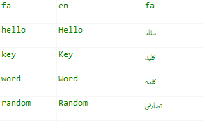

# localization_table

Localize you app using a localization table.

## How to use

1. Create your table file with the `.csv` format.

2. Put your supported languages in the first row, starting from the second cell.

3. Put your string keys in the first column, starting from the second cell.

4. Put your default language in the first cell at (0,0).

Example Table:



5. Add the LocalizationTableDelegate to your locale delegates.

```dart
MaterialApp(
   localizationsDelegates: [
     LocalizationTableDelegate('assets/table.csv'),
     GlobalWidgetsLocalizations.delegate,
     GlobalMaterialLocalizations.delegate,
     GlobalCupertinoLocalizations.delegate,
   ],
   supportedLocales: [
     Locale('fa'),
     Locale('en'),
   ],
    home: /* ... */
)
```

6. Use directly with `LocalizationTable.of(context).get(key)` where key is the string key of the value you want.  


### Using the extension method

For ease of use there is a built in extension method that can be used in flutter projects that use dart 2.7.0 or higher.

#### Example
```dart
    Text('login'.getString(context))
``` 

## How to use without buildContext

```dart
void backgroundEntryPoint() async{
  final locale = Locale('en'); 
  
  final table = await LocalizationTableDelegate('assets/table.csv').load(locale);
  
  String appName = table.get('app_name');
  
  showNotification(appName);
}
```
